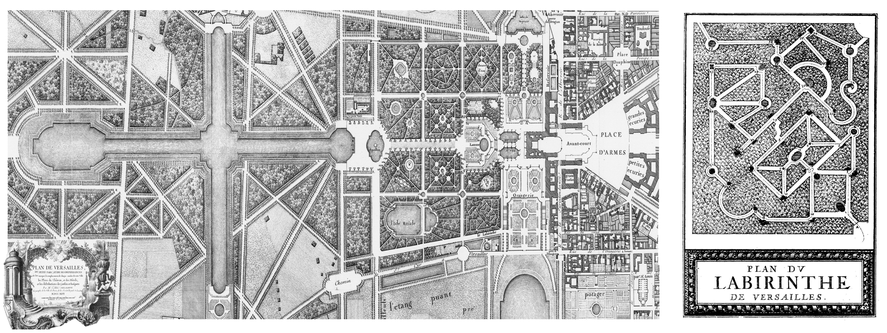
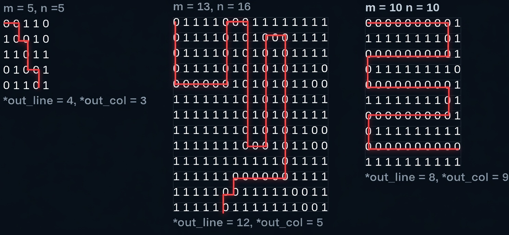
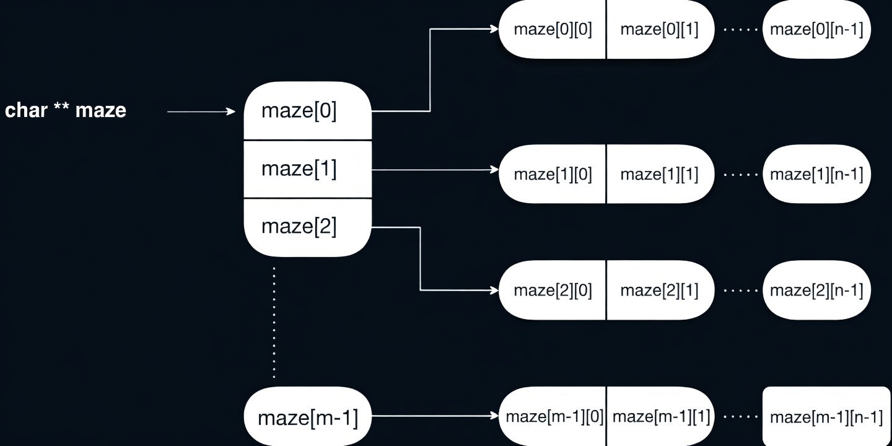
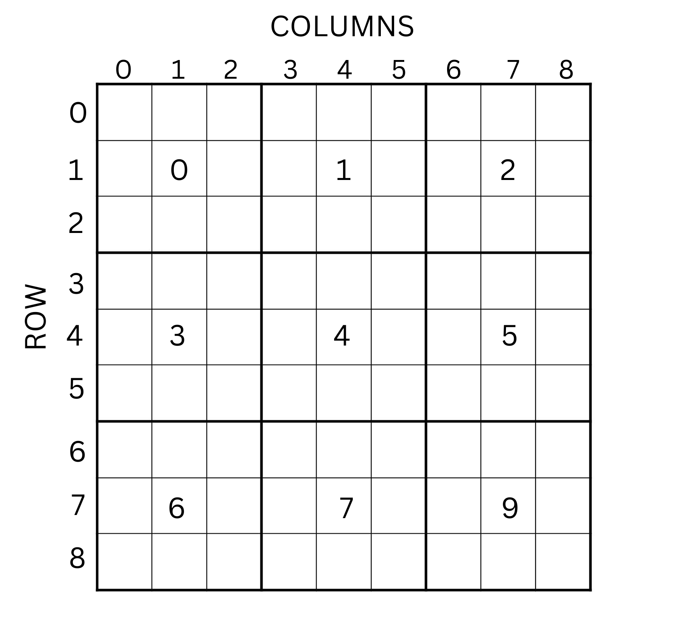

# Homework 2 - Coding Across Europe: Eli and Edi’s Adventure

**Authors**
- Kaan Nasurla
- Victor Davidescu

---

### DEADLINE SOFT: 30.04.2026
### DEADLINE HARD: 05.05.2026

---

### Eli & Edi are back!
Following the first task, Eli and Edi — our freshman students — returned with new challenges for you. In their mission to escape Instagram’s endless scroll, they begun implementing a much more powerful algorithm that will revolutionize the world. In building this top-secret algorithm, Eli is looking for help with implementing certain parts she can’t handle right now and Edi want to optimize Eli's work!

<div align="center">
    
</div>

**Eli advises you to complete the assignment on the PCLP2 virtual machine.**
**If you're working on a different system (WSL, native Linux), Edi advises you to also test your solution on the PCLP2 virtual machine.**

---

The unbeatable duo from homework 1 continues their adventure in topic 2, only this time you get to know each other better, and because you are friends, they reveal their real identities: Elisa and Eduard. The two tell you that they have been inseparable friends since the first day of college, from the first programming course where they sat next to each other. They share common passions and interests, including traveling, technology, and having fun with friends.

After an academic year full of exams, assignments, and projects, they decided to celebrate their success with a memorable vacation through the great cities of Europe. Although they are excited about the adventure, they know that in each destination an assembly programming challenge awaits them — the subject that made them both suffer and fall in love with computers.

In order to enjoy the landscapes and atmosphere of each place without worries, they need your help. So, from now on, throughout the journey, the two friends will become Elisa (Eli) and Eduard (Edi) for you, and you will be their traveling partner on this European adventure.

Their first destination was Paris. As the plane slowly descended, Eli pressed her face against the window, fascinated by the glowing city lights, while Edi was already thinking ahead, planning routes and schedules.

- “First stop: the Eiffel Tower. Second stop: food,” Edi said with a confident smile.

- “Third stop: somehow solving the assembly challenge waiting for us,” Eli added, laughing.

From that moment, you realized this trip would be anything but ordinary.

The next morning, after enjoying fresh croissants and hot coffee at a small, cozy café, the three of you headed toward the Eiffel Tower. The streets were full of life — musicians playing on the sidewalks, artists painting, and tourists exploring every corner.

Everything felt perfect… until Edi’s phone suddenly buzzed. He froze for a second. “I think it’s time.” Eli leaned closer as he opened the message. You read it together:

“Welcome to Paris! Your challenge: decode the hidden message using bitwise operations. Only then will you unlock your next destination.”

The three of you found a quiet place in a nearby park. Edi opened his laptop, Eli started writing ideas in her notebook, and you joined them, ready to help. At first, the sequence of numbers seemed completely random.

- “Maybe we should try XOR operations,” Eli suggested thoughtfully.

- “Or bit shifting,” you added.

Time passed quickly, but step by step, the puzzle began to make sense. Working together, combining your ideas, you finally reached a solution. With a deep breath, Edi pressed “run.” For a moment, nothing happened. Then, a new message appeared on the screen:

**“Congratulations. Next destination: French Riviera.”**

- Eli jumped up excitedly. “We did it!”

- Edi smiled, closing his laptop. “And this is just the beginning.”

As the sun slowly set behind the Eiffel Tower, casting a warm golden light over the city, you realized that this journey was more than just a vacation. It was about challenges, teamwork, and friendship.

Pack your bags and take the Paris metro to Charles de Gaulle Airport!

And deep down, you knew one thing for sure: the adventure had only just begun!

<div align="center">
    
</div>

---
## Task 1 - Monaco Grand Prix (20p)


### The Story

Eli and Edi have just arrived in Monte Carlo, the heart of luxury and speed. It's Formula 1 Grand Prix weekend, and the atmosphere is electrifying. While taking Instagram-worthy photos of each other along the famous harbor, they notice a distressed Ferrari engineer staring at a dead screen.

The team's telemetry system has crashed exactly when they needed real-time calculations for race strategy. Without live data, they cannot optimize tire degradation or fuel consumption. The former programmer left two weeks ago, and no one understands the legacy assembly code that powers the low-level telemetry processing.

Spotting Eli's and Edi's laptops in their backpacks, the engineer approaches them with a desperate plea: "You look like you know computers! We have 10 minutes before the next pit window. Please help us fix this data!"

The engineer explains that the telemetry system stores car performance data in two parallel arrays:
- One array contains lap times (in seconds)
- One array contains error flags (1 = corrupted, 0 = OK)

Due to a sensor malfunction, some cars have corrupted data, and their lap times need to be repaired before the strategy algorithm can run.

Eli and Edi immediately think of you, their programming partner. They know you can write the fast assembly code needed to traverse the arrays, identify errors, and fix the corrupted values – all in the blink of an eye, just like the Formula 1 cars speeding around the circuit!


<div align="center">
    
</div>

---

## Problem Statement

You are given two parallel arrays:
- `drivers_in_time[]` – array of lap times (unsigned integers, 4 bytes each)
- `errors[]` – array of error flags (char/byte, 1 byte each, 0 = OK, 1 = corrupted)

Both arrays have the same length (`num_drivers`).

Your task is to repair the corrupted data, generate the fixed lap times in an output array, and return statistics about the errors found.

---

## Subtask 1 – Counting Errors

Traverse the entire array and count how many cars have the error flag set to 1.

**Input:**
- `RDI` = address of errors array (pointer to first byte)
- `RSI` = number of drivers (array length)

**Output:**
- `RAX` = total number of drivers with error flag = 1
---

## Subtask 2 – Modify the Array – Fix Corrupted Lap

After counting the errors, generate the corrected lap times in the output array according to these rules:

- If a driver has `error == 0`, copy its `time` unchanged to the output array..
- If a driver has `error == 1`, repair its `time` field using the following logic:
  - Case 1 - Middle element: If the corrupted driver is neither first nor last (i.e., it has both previous and next neighbors), set its time to the average of the previous driver's time and the next driver's time. Use integer division and round down.
  - Case 2 - Edge element: If the corrupted driver is either first or last:
    - If it is the first element (no previous driver), set its time equal to the next driver's time.
    - If it is the last element (no next driver), set its time equal to the previous driver's time.

**Important:** When computing the fix for a corrupted driver, always use the original (input) values from the neighbors in drivers_in_time, not values that might have already been written to drivers_out_time.

**Input:**
- `RDI` = address of input lap times array (unsigned int, 4 bytes each)
- `RSI` = address of errors array (char, 1 byte each)
- `RDX` = number of drivers
- `RCX` = address of output lap times array (where to write fixed times)
- `R8` = address of integer where to store the error count

**Output:**
- `drivers_out_time` array is filled with fixed lap times
- `*error_count` (at address R8) is set to number of errors found
- No return value in RAX (void function)

**Example:**

Input:
```c
num_drivers = 8
drivers_in_time: [75, 82, 91, 68, 79, 88, 95, 73]
errors:         [ 0,  1,  0,  1,  0,  1,  0,  1]
```
Processing:

Index 0: error=0 → copy 75

Index 1: error=1, middle → (75+91)/2 = 83

Index 2: error=0 → copy 91

Index 3: error=1, middle → (91+79)/2 = 85

Index 4: error=0 → copy 79

Index 5: error=1, middle → (79+95)/2 = 87

Index 6: error=0 → copy 95

Index 7: error=1, last → copy previous = 95

Output:
```c
error_count = 4
drivers_out_time: [75, 83, 91, 85, 79, 87, 95, 95]
```
---

## Constraints

- Array length: 1 ≤ `num_drivers` ≤ 10,000
- Lap times: 60 ≤ `time` ≤ 200 (seconds)
- Error flag: 0 or 1

---

## Task 2 - The Royal Labyrinth of Versailles: A Garden of Mythological Enigmas (25p)


### The Story

The labyrinth in the gardens of the Château de Versailles was one of the most fascinating attractions of the royal estate during the reign of Louis XIV. Created in the 17th century by the famous landscaper André Le Nôtre, the labyrinth was conceived not only as a decorative element, but also as an educational and symbolic space. Its winding alleys were delimited by high hedges, which formed a complex and challenging route for visitors.

Inside the labyrinth were numerous fountains decorated with sculptures inspired by the fables of Jean de La Fontaine. Each intersection offered a moral lesson, transforming the walk into an interactive and cultural experience. Visitors, including members of the royal court, were invited to discover the hidden meanings of these stories as they tried to find the way out.

Although extremely popular, the labyrinth was demolished in 1778, as it was considered expensive to maintain. In its place, a simpler English-style garden was created. Today, the labyrinth no longer exists, but it remains an important part of the history and charm of the gardens of Versailles, symbolizing the elegance, complexity and refinement of the French Baroque era.

<div align="center">
    
</div>

---

## Problem Statement

Currently, the gardens of the Château de Versailles are in the form of a two-dimensional array (a matrix) of characters, dynamically
allocated. The two adventurers, Eli and Edi, buy entrance tickets, Eli takes a ticket for the palace only, while Edi buys a ticket
that includes entry to the palace gardens. In this sense, upon completing the guided tour of the palace, Eli goes to the exit of the
gardens to wait for his boyfriend, while Edi must find the exit and meet his girlfriend, Eli. Since the duo studies computer science,
they realized that it is much easier to find the solution by coding the following:

- Each element in the matrix is ​​associated with a cell of the maze.
- When the value of an element in the matrix is ​​1 (ASCII code 0x39), that cell is represented by a water channel, and Edi cannot move through it.
- When the value of an element in the matrix is ​​0 (ASCII code 0x30), that cell is free, and Edi can move into it.

Edi's position in the maze is represented by cartesian coordinates, a pair (line, column).
If the maze has m lines and n columns, we will have lines and columns numbered from 0 to m - 1, respectively from 0 to n - 1. Edi will
always start from the origin, that is, the position (0, 0) and can move to one of the neighboring cells above, below, on the right, or
on the left. For a simpler mathematical modeling, Edi **cannot** move diagonally.
The exit from the maze and the reunion with Eli is achieved when Edi manages to reach line m - 1 or column n - 1 of the maze.
Your goal, as a friend of the unbeatable duo, is to find the line and column to exit the maze.

To simplify the task, Eli offers the following guarantees:

From each current position, Edi can only access the previous position (something that must be avoided, so as not to go back on the
road) and a single future position, the rest of the neighboring boxes being occupied by walls formed by plants.

To solve the maze, the famous landscape architect André Le Nôtre will ensure that there is only one correct solution.

The function definition is:

```c
void solve_labyrinth(unsigned int *out_line, unsigned int *out_col, unsigned int m, unsigned int n, char **maze);
```
**Input:**
- `out_line` = pointer to the line index corresponding to the box through which Edi exits the maze
- `out_col` = pointer to the column index corresponding to the box through which Edi exits the maze
- `m` = the number of lines in the maze
- `n` = the number of columns in the maze
- `maze` = the two-dimensional array, dynamically allocated, containing the representation of the maze

---

## Extra information
Your code must solve the maze and save the exit line index at the out_line address, and the exit column index at the out_col address.



## HINT!
To be sure that at no step Edi return to the previous position (which can lead you into an infinite loop), you can always mark the
current position with the character 1 before moving on.

---

A dynamically allocated array has the form shown in the figure below.
Unlike a statically allocated two-dimensional array, in this case we cannot guarantee that successive rows in the array will be placed
one after the other in memory, but only that each row is contiguous in memory.
For more details, you can also consult [this section](https://cs-pub-ro.github.io/hardware-software-interface/labs/lab-02/reading/memory-operations.html#reading-pointers) in the lab.



---

## Task 3 - The London Airport Challenge (25p)

### The Story

After their success in Frankfurt, Eli, Edi, and you flew to London. The city welcomed you with its characteristic fog and the iconic sound of a double-decker bus passing by Big Ben. You had plane tickets for the journey home, but there was a problem: all flights had massive delays due to a storm in Northern Europe. The airline needed your help.

"Welcome to Heathrow Airport!" the agent at the desk said. "We need your help with three tasks related to the plane tickets."

First, you had to apply the delays to every ticket. For each flight, you added the delay minutes to both departure and arrival times. If minutes exceeded 59, you carried over to hours. If hours exceeded 23, you carried over to days. Soon, every flight showed the correct new schedule.

Second, the airline wanted to filter passengers with unsuitable luggage. Because of the storm, planes with too light of a load are vulnarable to heavy winds. Take out from the timetable any flights that have a bag weight too low. 

Finally, it's time to find the best ticket for Eli & Edi's next destinaton. Sort the ticket array in place(first by day, then by hour, then by minute, then by weight, a heavier luggage limit being considered better). Implement whatever sorting algorithm you want. Return the ticket that best fits Eli & Edi's request. Return 1 if there is a flight going to Eli & Edi's wanted destination or 0 if not. 

The agent thanked you warmly. As you left the airport, the London fog began to lift, revealing a beautiful sunset over the city. Another challenge completed, another city conquered. Your European adventure continued, one assembly task at a time. ✈️

<div align="center">
    
</div>

---

## Problem statement

---

You are given an array of structs of type ticket with the following layout:

| Offset | Size | Field                  | Example      |
|--------|------|------------------------|--------------|
| 0      | 32   | destination            | Cluj-Napoca  |
| 32     | 1    | departingTime.day      | 15           |
| 33     | 1    | departingTime.hour     | 10           |
| 34     | 1    | departingTime.minutes  | 30           |
| 35     | 1    | arrivingTime.day       | 15           |
| 36     | 1    | arrivingTime.hour      | 12           |
| 37     | 1    | arrivingTime.minutes   | 45           |
| 38     | 2    | bag_weight             | 25           |
| 40     | 1    | delayMinutes           | 10           |
| 41     | 1    | delayHours             | 2            |

The next subtasks will test your ability to work with arrays of structs in asm. You are expected to write your own structs following the given layout.

## Subtask 1 – Apply delays

#### Context

Due to the storm in Northern Europe, all flights have experienced delays. Each plane ticket contains delayMinutes and delayHours fields indicating the delay for that specific flight. You need to update the departure and arrival times for every ticket.

**Requirement:** Implement the apply_delay function that receives an array of tickets and their count, and adds the delay to each ticket.


You will have to implement the delay algorithm, the function you have to implement has the following header:
<br>
```c
        void apply_delay(struct ticket* tickets, int nrTickets);
```
<br>

- `RDI` = address of the tickets array (struct ticket* tickets)

- `RSI` = number of tickets (int nrTickets)
<br>

The function must be completed in the `subtask1.asm` file.

> **Other details** <br>
> You must write your own structures defined in the README (struc date and struc ticket).

> The size of a ticket is ticket_size (42 bytes).

> The delayMinutes and delayHours fields are located at the end of the structure.

> The checker will not check the delay fields from the resulting array for any of the subtasks. Up to you if you set those fields to 0, ignore them, etc.

> All flights will still be in the same month, even after applying delays

---

## Subtask 2 – Filtering Tickets by Luggage Weight

#### Context

The airline wants to keep only flights' tickets who have sufficiently heavy luggage. You need to copy into a new array only the tickets that meet the minimum weight requirement.

**Requirement:** Implement the filter_tickets function that receives the original array, a destination array, the number of tickets (passed by pointer), and the minimum luggage weight. The function will copy to the destination array only the tickets with bag_weight >= min_bag_weight and update the ticket count. Update the number of tickets/RDX to reflect the number of elements in the destination array.

The function you have to implement has the following header:
<br>
```c
        void filter_tickets(struct ticket* origTickets, struct ticket* destTickets, int* nrTickets, int min_bag_weight);
```

<br>

- `RDI` = address of the original tickets array (struct ticket* origTickets)
<br>

- `RSI` = address of the destination array (struct ticket* destTickets)
<br>

- `RDX` = address of the integer containing the number of tickets (int* nrTickets)
<br>

- `RCX` = minimum luggage weight (int min_bag_weight)


The function must be completed in the `subtask2.asm` file.

> **Rules** <br>
> Update the value at address nrTickets with the new count of filtered tickets.

> Populate the new destination tickets array

---

## Subtask 3 – Sorting and Finding the Best Ticket

#### Context

You must first sort all tickets by arrival time (earliest is best). In case of a tie, the ticket with heavier luggage is considered better. Then, you need to search for the first ticket matching the requested destination and return it.

The function you have to implement has the following header:
<br>
```c
        int sort_and_return(struct ticket* tickets, int nrTickets, struct ticket* bestTicket, char* destination);
```
<br>

- `RDI` = address of the tickets array (struct ticket* tickets)

- `RSI` = number of tickets (int nrTickets)
<br>

- `RDX` = address of the structure where the found ticket will be copied (struct ticket* bestTicket)
<br>

- `RCX` =  address of the string representing the searched destination (char* destination)

The function must be completed in the `subtask3.asm` file.

> **Rules** <br>
> Sorting rules (descending priority - smaller = better for times):

- Compare days (smaller day = earlier = better)
- If days are equal, compare arrivingTime.hour
- If hours are equal, compare arrivingTime.minute
- If minutes are also equal, compare bag_weight (larger = better)
- Only compare the arriving values, Eli & Edi don't care about the departing times for this task

> Return values:

- `RAX` = 1 if a ticket with the requested destination was found

- `RAX` = 0 if no ticket with the requested destination exists

- `RDX` = address of the structure that will hold the found ticket

> Notes: 

- The destination string will at most be 32 bytes (including the terminator)


## Task 4 - Sudoku (20p)

### The Story

Eli and Edi have just boarded their next flight and find themselved a bit bored. What is there to do on long and monotone flight? Luckily, Eli comes up with a nice way of passing time: playing Sudoku!

What he would usually do is check out [his favourite sudoku youtuber](https://www.youtube.com/channel/UCC-UOdK8-mIjxBQm_ot1T-Q) and choose a sudoku from there, but today he wanted to take a break from all the technology and go old-school: Pen and Paper.
There is one problem though: he wants to be 100% sure he didn't make any mistakes.
Help him out by making a small checker that tells him which rows, columns, or boxes are wrong (if any).

<div align="center">
    
</div>


## Problem Statement
You are given a 2D array of numbers. The array's size will either be 4x4, 9x9 or 16x16.

Each row of the array has to contain every number fron 1 to the array's size once and no more. This rule also applies to every column.

The array is split into boxes of sqrt(array size) x sqrt(array_size). These boxes also have to follow the rule explained above.

---

### The Task

First, let's recap the rules of sudoku (for a 9x9 board):
- In each row, the digits 1-9 must appear exactly once
- In each column, the digits 1-9 must appear exactly once
- In each box, the digits 1-9 must appear exactly once
- Rows are numbered 0 to 8 from top to bottom.
- Columns are numbered 0 to 8 lef to right.
- Boxes are numbered 0 to 8 from the top-left, and continuing left to right, wrapping around when hitting the right edge of the board (see image).

<!--  -->
<div align="center">
    
</div>

Reminder: Eli and Edi are crafty people and will not stick to Sudoku boards of size 9. Some of the tests' board will be of size 4 or 16.

## Subtask 1 - Verify a row
Being given the array, its size and a certain row, verify if the row respects Sudoku's rules.

**Input**
- `RDI` = address of the array
- `RSI` = size of the array
- `RDX` = the row you must verify

**Output**
- `RAX` = 1 if the row respects the rule. 0 if not

---

## Subtask 2 - Verify a column
Being given the array, its size and a certain column, verify if the column respects Sudoku's rules.

**Input**
- `RDI` = address of the array
- `RSI` = size of the array
- `RDX` = the column you must verify

**Output**
- `RAX` = 1 if the column respects the rule. 0 if not

---

## Subtask 3 - Verify a box
Being given the array, its size and a certain box, verify if the box respects Sudoku's rules.

**Input**
- `RDI` = address of the array
- `RSI` = size of the array
- `RDX` = the box you must verify

**Output**
- `RAX` = 1 if the box respects the rule. 0 if not

---

## Extra information
As the matrix will be indexed starting from 0, so will the rows/columns/boxes. Thus, rdx will hold values from 0 to (array_size - 1)

## HINT!
Here is a basic way of checking if a sudoku line/row/box is valid:
((the sum of all numbers == size * (size + 1) / 2) && (the product of all numbers == factorial(size)))

---

## Coding Style (10p)

To be able to use your solutions in the implementation of the secret algorithm, Eli needs well-structured and readable assembly code that follows a few good practice rules:

- writing readable code
- consistent indentation (the recommendation is to place labels at the beginning of the line and indent instructions with one tab)
- using meaningful names for labels
- including **relevant and necessary** comments in the code

---

## Checker

Simply run ./checker/checker.sh to verify the homework locally. You must upload your zip on moddle for your actual grade (use the make pack rule)

If you wish to verify a certain test from a task, run the checker executable from its directory.

For example, for verifying test 2 from task 3:
./src/task3/checker 2

---

**Eli and Edi thanks you for your help and looks forward to seeing you for Assignment 3 from PCLP2 as well!!**
<div align="center">
    
</div>
